# ihv-eudi-jp

eIDAS2.0 / ARF 準拠の **Issuer–Verifier–Holder（IHV）デモ**（日本属性）。
OID4VCI 1.0 で発行、OID4VP 1.0 + HAIP で提示、**mso_mdoc / SD-JWT VC** の選択的開示、
DC API 連携（OID4VP over DC API=実機確認済み／Annex C `org-iso-mdoc` は暗号面のみ準拠の簡略実装・実機非互換）、Token Status List 失効、そして DC API を使わない
**Web ウォレット経路（HTTPS リダイレクト）**まで。設計の単一ソースは `CLAUDE.md`、詳細は `docs/`。

## 動作イメージ

3 つの独立オリジン（発行者 / ウォレット / 検証者）で構成され、役割ごとにヘッダー色・favicon・タブタイトルが変わります。
発行者で選んだ和色グラデーションのカードが、そのままウォレットに並びます。

| 発行者（Issuer） | ウォレット（Holder） | 検証者（Verifier） |
|---|---|---|
| 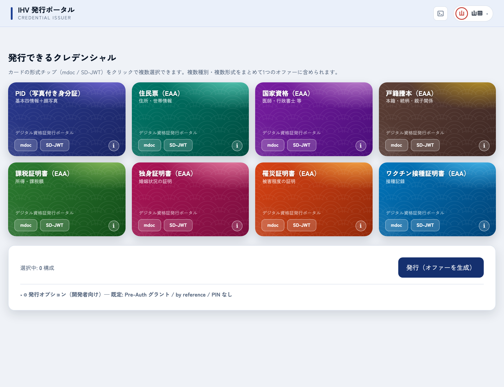 | 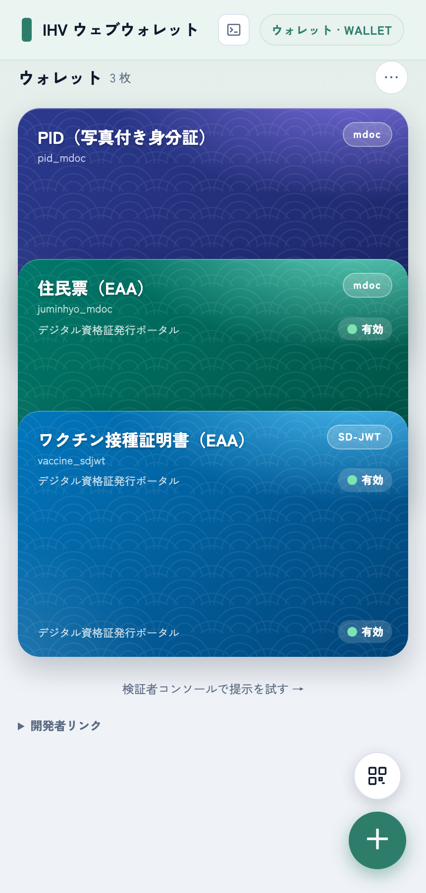 | 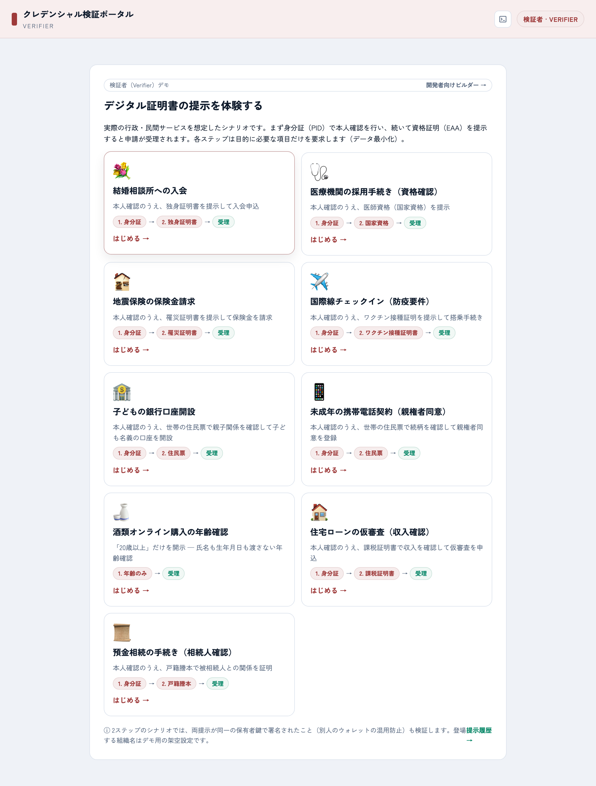 |
| 発行できるクレデンシャルを選び「発行（オファーを生成）」→ QR / リンクでウォレットへ | 受領したクレデンシャルをカードで一覧。➕ でカタログ発行、QR でオファー受領 | 実在の民間手続きを模した 9 シナリオ（8 文書を使用）でステップ型の提示・検証を体験 |

> **実機動作確認**: **Multipaz Wallet（Android）で mdoc 形式について、発行（OID4VCI + PAR + DPoP）から
> 提示（OID4VP over DC API / Annex D）まで簡易的に動作確認済み**です。SessionTranscript の
> `jwk_thumbprint`（bstr）整合など、外部の参照実装（Multipaz）に対する相互運用を確認しています。
> DC API 提示の詳細フローと修正経緯は `CLAUDE.md`（M6）を参照。

## クイックスタート

```bash
npm ci              # 依存復元（package-lock.json あり）
npm run setup       # dev PKI + trust-list + schemas を生成（pki/ は gitignore のため必須）
npm test            # 117 tests（node:test）
npm run coverage    # c8（対象 src/**）
```

> Claude Code で開く場合: 上記のあと `git init && git add -A && git commit -m init` →
> リポジトリ直下で `claude`。`CLAUDE.md` が自動でプロジェクト文脈として読まれます。

## デモの流れ（代表シナリオ）

3 つの独立オリジン — **発行者（Issuer・青）／ウォレット（Holder・ティール）／検証者（Verifier・煉瓦）** — を
ブラウザだけで行き来する代表フローです。ヘッダー色・favicon・タブタイトルでどのサイトにいるかが常に分かります。

### 発行 — Issuer → Holder（OID4VCI / pre-authorized_code）

発行者ポータルでクレデンシャルを選んで「発行」を押し、オファーをウォレットへ受け渡します（QR＝別端末／
リンク＝同一端末。コピー&ペースト不要）。

| ① クレデンシャルを選択して発行 | ② ウォレットへの受け渡し（QR とリンク） |
|---|---|
| 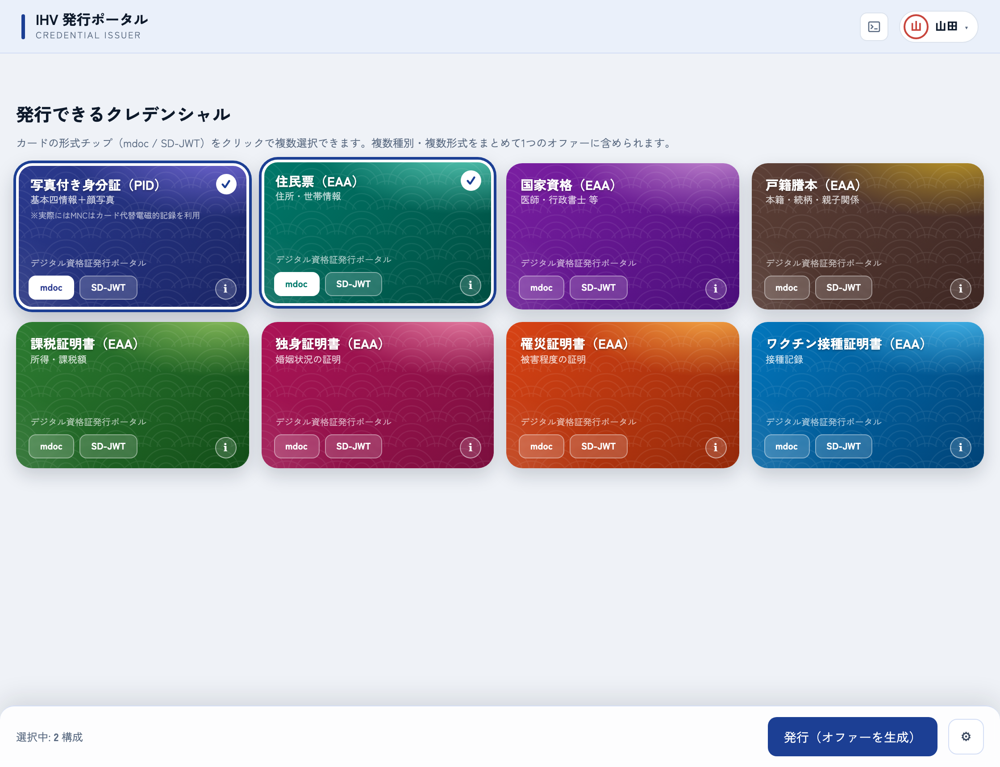 | 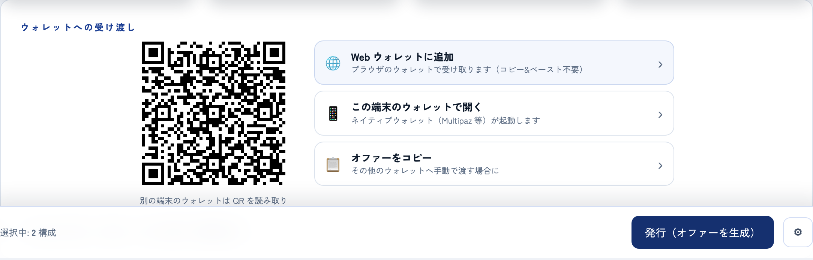 |

| ③ Web ウォレットが受領（OID4VCI） | ④ 保管一覧（選択的開示のソースになる） |
|---|---|
| 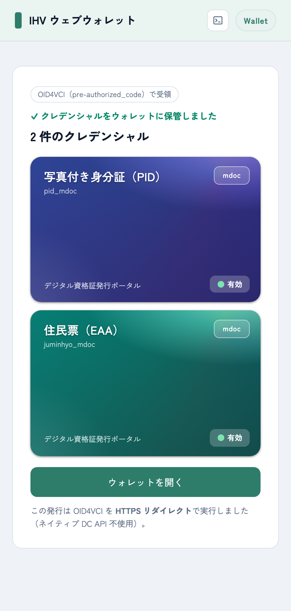 | 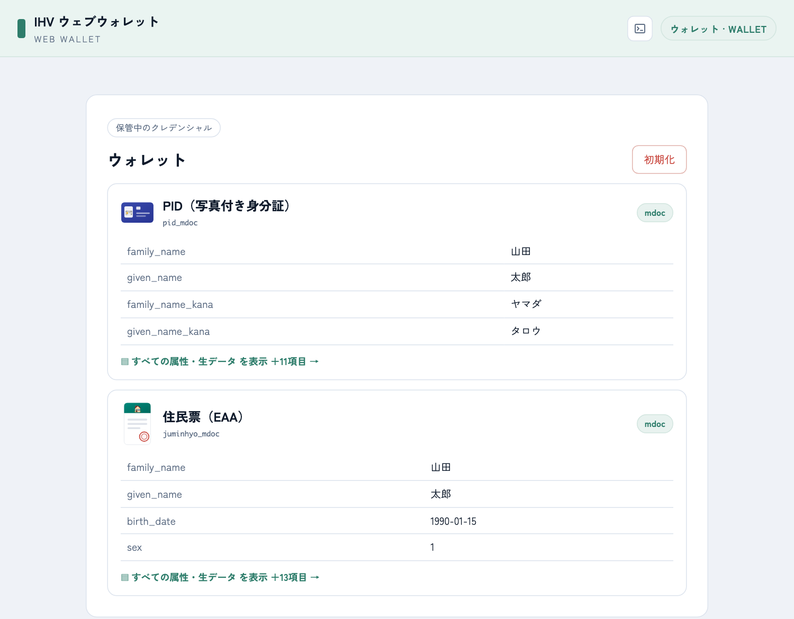 |

### 検証 — Holder → Verifier（OID4VP + HAIP・ステップ型シナリオ）

検証者は実在の手続きを模した **9 シナリオ**（8 種の文書を全て使用）を提供。代表例
**「子どもの銀行口座開設」**では、Step1 で保護者の本人確認（PID）、Step2 で住民票（世帯全員・続柄記載）を
`linkTo` 連鎖で提示し、**世帯員に「子」がいること＋2 回の提示が同一の保有者鍵で署名されたこと**を検証して受理します。

| ① シナリオを選ぶ | ② ウォレットの同意画面（Step2: 住民票） |
|---|---|
| 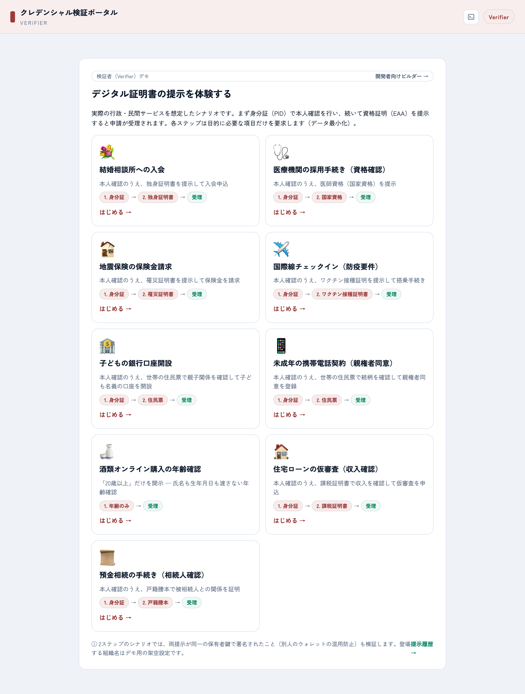 | 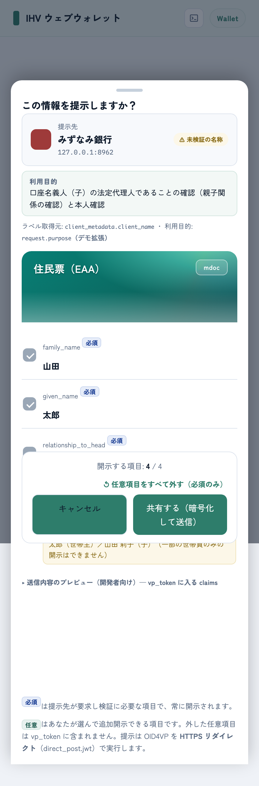 |

| ③ Step1 完了（本人確認） | ④ 受理（親子関係＋同一鍵を確認） |
|---|---|
| 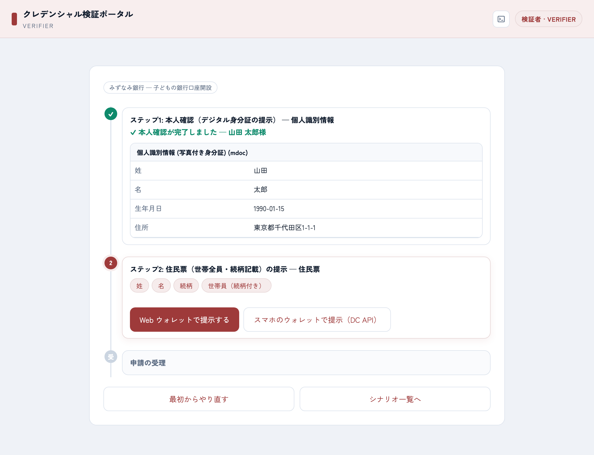 | 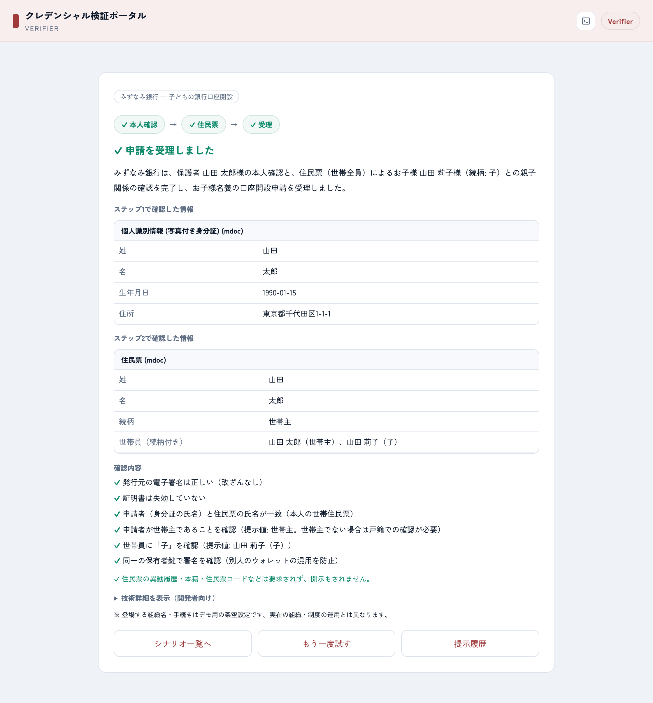 |

同意画面には **提示先（client_metadata.client_name）・利用目的（request.purpose）・開示される項目と値・
世帯全員が開示される旨の警告** が表示され、必須／任意（holder が外せる）を選んで暗号化送信（direct_post.jwt）します。
mdoc / SD-JWT のどちらの形式で発行されていても提示できます（DCQL `credential_sets` による形式代替）。
各画面のヘッダー `>_` から**開発者コンソール**（Token/Credential/OID4VP の実通信・部分マスク付き）を開けます。

## 構成

```
src/        コア（cbor/cose/mdoc/sdjwt/dcql/jwe/status/handover）＋ issuer/oid4vci/verifier/wallet
            ＋ app.mjs(Hono) ＋ wallet-app.mjs(Web ウォレット) ＋ *-demo.mjs(画面)
web/        issuer.html / verifier.html / mockups / captures（生成物・gitignore）
schemas/    8 クレデンシャル定義 + credential-catalog.json（16 構成 = 8×{mdoc,SD-JWT}）
pki/        dev PKI（gitignore・npm run setup で生成）   trust/  trust-list.json（LOTL モック）
test/       単体テスト（I→H→V 往復・golden・否定経路）   scripts/ 生成・interop・UIキャプチャ
docs/       architecture / verifier-scenarios / mdoc-handover / web-wallet / testing / interop / deploy
worker.mjs  Cloudflare Workers 入口     wrangler.toml
```

## デモ画面のキャプチャ（任意）

```bash
npx playwright install chromium     # 初回のみ（ヘッドレス Chromium）
node scripts/capture-authcode.mjs   # 認可コード（wallet/issuer 起点）
node scripts/capture-verify.mjs     # 検証者コンソール（DCQL/選択開示）
node scripts/capture-webwallet.mjs  # Web ウォレット発行（pre-auth + auth-code, 2オリジン）
node scripts/capture-webverify.mjs  # Web ウォレット提示/検証（OID4VP redirect, 3オリジン）
```

## 再生成・相互運用

```bash
npm run interop      # Multipaz 突合用の参照ベクトル(hex)（docs/interop.md）
npm run setup        # PKI / trust / schemas を再生成
```

## 現状

M1–M5 完了。POST-M5 で Offer 配送・失効・16 構成・authorization_code(PKCE)＋セッション/persona・
Annex C/D 選択ディスパッチ・検証者コンソール・**Web ウォレット（発行/提示）**まで実装。
ロードマップは `CLAUDE.md`。残りは Web ウォレット項目選択UI、M6 Android(DC API) 実機、M7 Workers 本番化。
