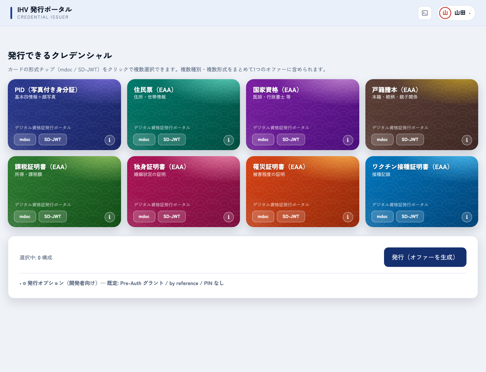
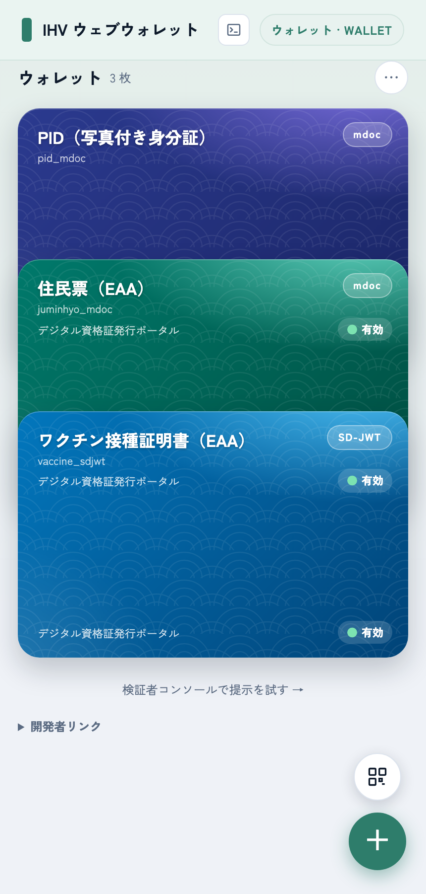
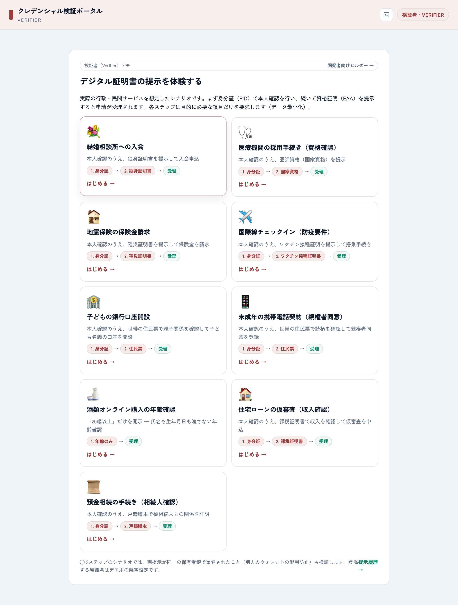
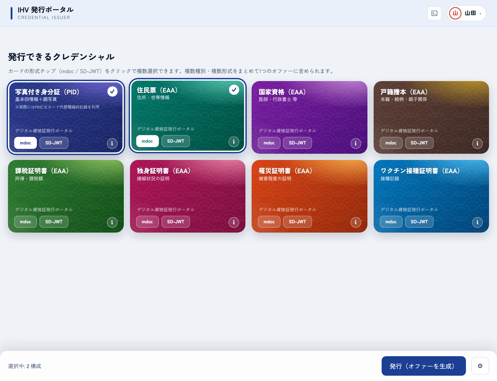
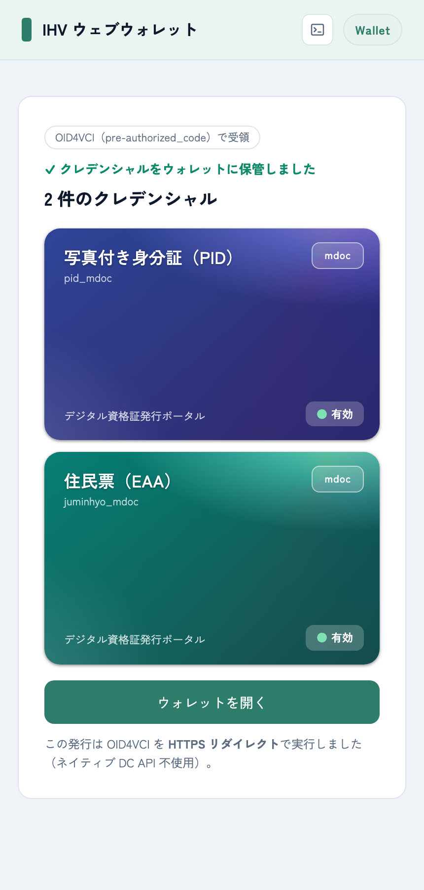
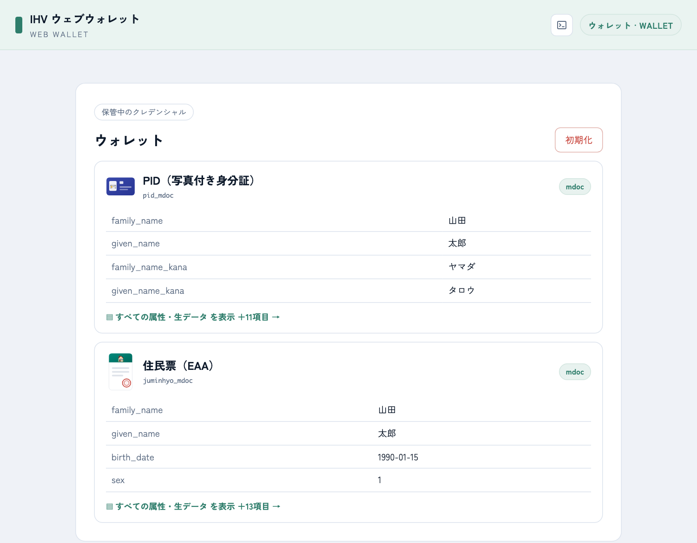
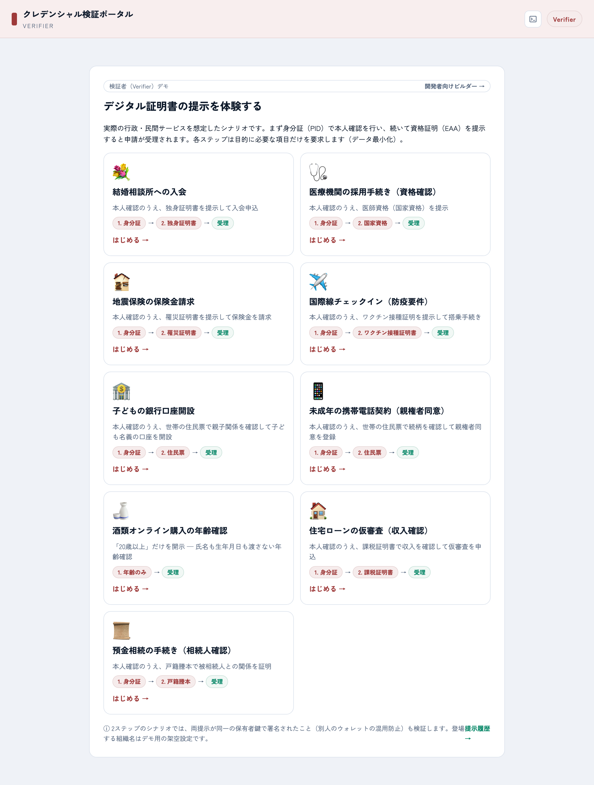
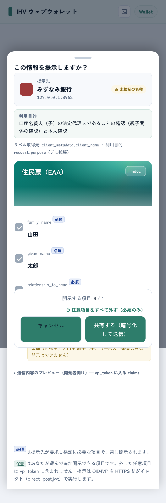
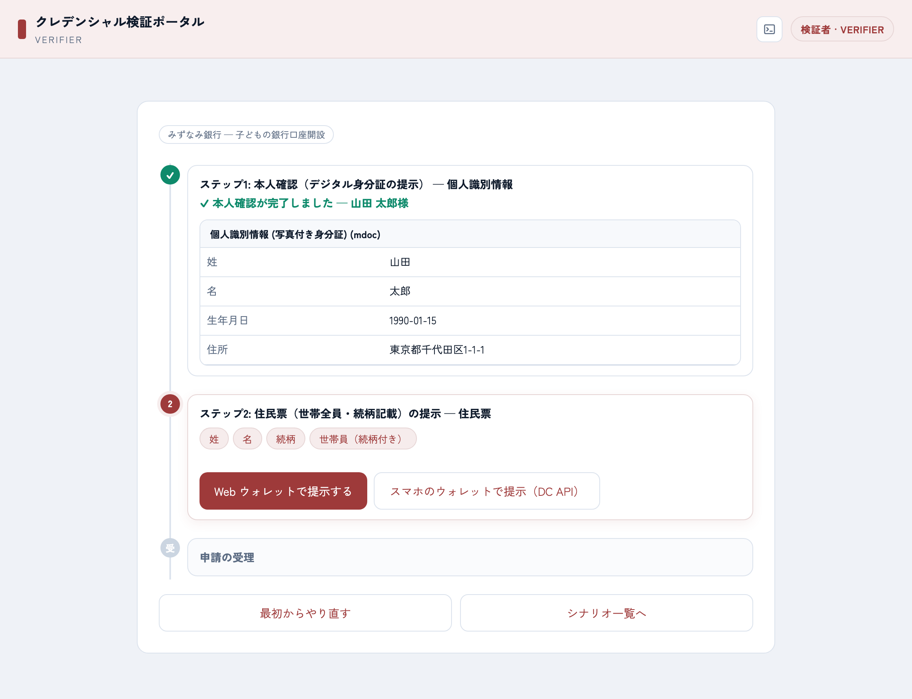
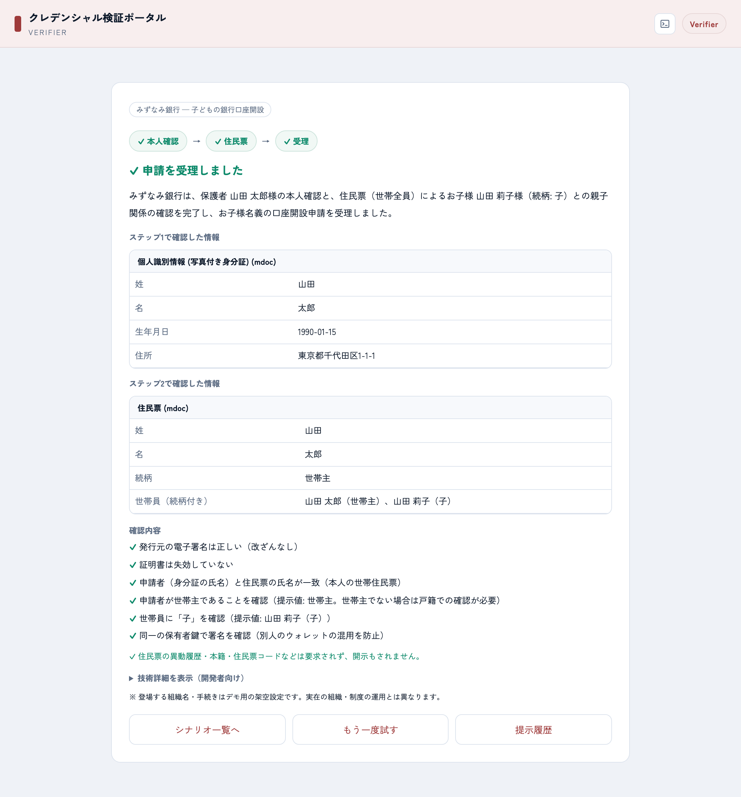

# ihv-eudi-jp

> [!WARNING]
> 本プロジェクトは、デモ・学習を目的としたプロトタイプおよびサンプル実装であり、
> 本番での運用を意図したものではありません。
> 登場する組織・人物・デジタル資格証等は全て架空のものです。

**デジタル資格証を「発行 → 保管 → 提示 → 検証」まで、ブラウザだけで一周できるデモ実装です。**

EU のデジタルID規則（eIDAS 2.0）とその技術仕様である ARF に沿って作られていますが、
載せている資格証は**日本の書類**です。住民票の写し、課税証明書、罹災証明書、
国家資格の証明など9種類を、実在の手続きを模した流れで扱えます。

```
発行者ポータル  ──オファー(QR/リンク)──▶  ウォレット  ──提示(OID4VP)──▶  検証者ポータル
   (Issuer)                              (Holder)                        (Verifier)
       ▲
       └── 自治体窓口(Admin) ── 罹災証明などは職員の審査を経てから交付される
```

---

## これは何を示すデモか

**紙の証明書を持ち歩く代わりに、スマートフォンの中の資格証で手続きを済ませる**世界を、
実装レベルで確かめるためのものです。次の3点を実際に動く形で示します。

**必要な項目だけを渡せること（選択的開示）**
「20歳以上か」を確認したい相手に、生年月日そのものを渡す必要はありません。
資格証は項目ごとに切り離せる形で発行され、提示のたびに何を渡すかを本人が選びます。

**誰が発行したかを検証できること**
資格証には発行者の署名が入り、検証者は公開されたトラストリストを辿って
「この署名は本物の発行者のものか」を確かめます。偽造された証明書は受理されません。

**発行者に提示先を知られないこと**
検証者は失効リストを丸ごと取得して手元で判定するため、
発行者は「誰がどこに資格証を見せたか」を観測できません。

---

## 画面

3つの独立したオリジン（発行者 / ウォレット / 検証者）で構成され、
役割ごとにヘッダー色・favicon・タブタイトルが変わるので、いま自分がどのサイトにいるかが常に分かります。

| 発行者（Issuer） | ウォレット（Holder） | 検証者（Verifier） |
|---|---|---|
|  |  |  |
| 資格証を選んで発行し、QR / リンクでウォレットへ渡す | 受け取った資格証をカードで一覧。追加・並び替え・失効確認 | 実在の手続きを模したシナリオを体験 |

このほかに**自治体窓口**（Admin）があります。罹災証明書と離島割引資格証は
自治体の審査を経ないと交付されないため、住民が申請し職員が認定する動線を別オリジンで実装しています。

---

## 使ってみる

### 手元で動かす

```bash
npm ci
npm run setup
npm test
```

**`npm ci`** — `package-lock.json` のとおりに依存パッケージを入れます
（`npm install` と違い、ロックファイルを書き換えません）。

**`npm run setup`** — このリポジトリには鍵も資格証の定義も入っていないので、**初回に必ず実行します**。
次の3つを作ります。

- `pki/` — 開発用の自己署名 PKI（発行者・検証者・リーダーの鍵と証明書）。
  **鍵を含むため git 管理外**です
- `trust/` — 誰を信頼するかのリスト（LoTE / VICAL / RICAL）
- `schemas/` — 9種類の資格証の定義。どの項目を持ち、券面をどう表示するかを決めます

**`npm test`** — 発行から検証までの往復、仕様のゴールデンベクタ、失敗経路を通します。
すべて通れば、手元の環境が正しく用意できています。

### 自分の Cloudflare アカウントに置く

**[GETTING_STARTED.md](GETTING_STARTED.md)** を参照してください。
KV の namespace id の差し替えなど、clone しただけでは動かない箇所があります。無料プランで足ります。

---

## 発行の流れ

発行者ポータルで資格証を選んで「発行」を押すと、オファーがウォレットへ渡ります。
別端末なら QR、同じ端末ならリンクで、コピー＆ペーストは要りません。

| ① 資格証を選んで発行 | ② ウォレットへの受け渡し |
|---|---|
|  |  |

| ③ ウォレットが受領 | ④ 保管一覧 |
|---|---|
|  |  |

---

## 提示・検証の流れ

検証者は実在の手続きを模したシナリオを用意しています。

代表例の「**子どもの銀行口座開設**」では、2段階の提示を行います。

1. 保護者の本人確認（PID を提示）
2. 住民票の写しを提示し、**世帯員に「子」がいること**を確認

さらに、**2回の提示が同じ保有者鍵で署名されたこと**を検証します。
これにより「本人確認した人と、住民票を出した人が同一である」ことを確認します。

| ① シナリオを選ぶ | ② ウォレットの同意画面 |
|---|---|
|  |  |

| ③ 本人確認が完了 | ④ 受理 |
|---|---|
|  |  |

同意画面には**提示先・利用目的・渡す項目とその値**が表示され、必須でない項目は本人が外せます。
世帯全員の情報が渡る場合はその旨が警告として出ます。送信は暗号化されます。

各画面のヘッダーにある `>_` から**開発者コンソール**を開くと、
実際に流れているプロトコルのやり取り（トークン要求・資格証発行・提示）を機微情報をマスクした形で観察できます。

---

## 対応している仕様

| 領域 | 内容 |
|---|---|
| 発行 | OID4VCI 1.0（事前認可コード / 認可コード + PKCE、PAR、DPoP） |
| 提示 | OID4VP 1.0 + HAIP（HTTPS リダイレクト経路と Digital Credentials API 経路の両方） |
| 資格証の形式 | **mso_mdoc**（ISO/IEC 18013-5）と **SD-JWT VC** の両方。同じ書類をどちらでも発行 |
| 失効 | Token Status List（形式ごとに独立したリスト） |
| 信頼 | ETSI TS 119602 LoTE、ISO 18013-5 VICAL / RICAL |
| クライアント認証 | Wallet Attestation、Key Attestation |
| 暗号 | ES256 / P-256、応答暗号化は ECDH-ES + A128GCM、DC API 経路は HPKE |

**9種類の書類 × 2形式 = 18構成**を発行できます。

### 外部の実装・試験との突き合わせ

自分のテストだけで「準拠している」と言わないために、外部の実装と試験に当てています。

- **Android 実機（Multipaz Wallet）** — mdoc 形式について、発行から提示まで一周を確認済み
  （Digital Credentials API の2経路とも）
- **OpenID Foundation の適合テスト（公式インスタンス）** — OID4VP は失敗ゼロ、
  OID4VCI も実装起因の未達はゼロ。残る未達は環境要因（`*.workers.dev` では
  TLS の最低バージョンを設定できない）と、測定ツール側の制約によるものです

---

## リポジトリの構成

```
src/          プロトコル実装（CBOR / COSE / mdoc / SD-JWT / DCQL / 失効 / 信頼）と
              4つの Worker（発行者・検証者・ウォレット・自治体窓口）、画面
schemas/      資格証の定義（生成物。scripts/gen-schemas.mjs から作る）
pki/          開発用の鍵と証明書（git 管理外。npm run setup が生成）
trust/        トラストリスト（LoTE / VICAL / RICAL）
test/         発行→提示→検証の往復、仕様のゴールデンベクタ、失敗経路
scripts/      生成・デプロイ・相互運用・画面キャプチャ
docs/         設計と運用のドキュメント
web/          静的アセット
```

---

## ドキュメント

| ファイル | 内容 |
|---|---|
| [GETTING_STARTED.md](GETTING_STARTED.md) | **自分のアカウントにデプロイする手順** |
| [docs/architecture.md](docs/architecture.md) | 全体構成 |
| [docs/trust-and-revocation.md](docs/trust-and-revocation.md) | 鍵の階層、トラストリスト、失効の仕組み |
| [docs/verifier-scenarios.md](docs/verifier-scenarios.md) | 各シナリオの設計意図 |
| [docs/wallet-attestation.md](docs/wallet-attestation.md) | ウォレットと鍵の真正性の検証 |
| [docs/web-wallet.md](docs/web-wallet.md) | Web ウォレットの設計 |
| [docs/mdoc-handover.md](docs/mdoc-handover.md) | DC API と mdoc のハンドオーバー |
| [docs/testing.md](docs/testing.md) | テストと外部適合テスト |
| [docs/deploy.md](docs/deploy.md) | 運用中の環境の保守 |
| [docs/interop.md](docs/interop.md) | 参照実装との突き合わせ |
| [docs/proximity-wallet.md](docs/proximity-wallet.md) | 対面提示（調査段階） |
| `CLAUDE.md` | 設計判断と実装上の落とし穴の記録。**AI コーディング支援向けの作業メモ**で、分量が多く仕様の引用が中心です |

---

## 補足

鍵は開発用の自己署名であり、本番の PKI や実在の自治体・発行機関とは一切関係がありません。
